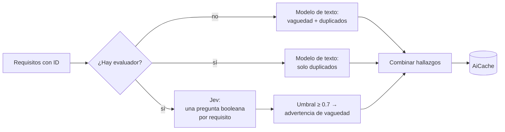

# Jev como IA de evaluación en la revisión de calidad

Este documento explica cómo se integró [Jev](https://vercel.com/ai-gateway/models/jev) (`typesafe-ai/jev`), el modelo de evaluación de TypeSafe AI servido por [Vercel AI Gateway](https://vercel.com/docs/ai-gateway/modalities/evaluation), en la revisión de calidad de requisitos (`/dashboard/[projectId]/quality`).

## Por qué un puerto nuevo y no un proveedor más

Jev **no genera texto**. El gateway lo publica con `type: "evaluation"` y `max_tokens: 0`: recibe un *estado compartido* y un conjunto de *preguntas tipadas* (`boolean`, `choice` o `score`) y devuelve, por pregunta, una elección, un puntaje o una probabilidad. Se invoca con `experimental_evaluate` del AI SDK (`ai@7`), no con `generateText`.

Por eso no puede implementar `IAiAssistant.complete(prompt): string`, que es lo que usan la redacción del SRS y la revisión de calidad. En vez de forzarlo, se agregó un puerto propio en el dominio:

```ts
// src/domain/ports/IAiEvaluator.ts
export interface IAiEvaluator {
  readonly modelId: string;
  evaluateBooleans(
    state: string | readonly Record<string, string>[],
    questions: Record<string, AiEvaluationQuestion>
  ): Promise<Record<string, number>>; // probabilidad (0 a 1) de "sí" por pregunta
}
```

El puerto solo expone preguntas de sí/no porque es lo único que se necesita hoy. Igual que con `IAiAssistant`, ni `domain` ni `application` conocen el SDK: todo lo del proveedor vive en `src/infrastructure/ai/`.

| Archivo | Rol |
|---|---|
| `src/domain/ports/IAiEvaluator.ts` | Puerto: estado + preguntas de sí/no → probabilidades |
| `src/infrastructure/ai/GatewayAiEvaluator.ts` | Adaptador: llama a Jev (u otro modelo de evaluación) vía AI Gateway |
| `src/infrastructure/ai/NullAiEvaluator.ts` | Adaptador nulo: lanza `AiUnavailableError` |
| `src/infrastructure/ai/GatewayAiAssistant.ts` | Proveedor de **texto** del gateway (`IAiAssistant`), independiente de Jev |
| `src/infrastructure/srs/qualityAnalysis.ts` | Lógica de la revisión: reparte los chequeos entre evaluador y asistente |
| `src/container/di.ts` | Decide si hay evaluador según `AI_GATEWAY_API_KEY` |

## Qué decide Jev y qué no

La revisión de calidad tiene dos chequeos de IA:

| Chequeo | Sin `AI_GATEWAY_API_KEY` | Con `AI_GATEWAY_API_KEY` |
|---|---|---|
| **Vaguedad** (cualidades subjetivas sin métrica) | Modelo de texto (`IAiAssistant`) | **Jev** (`IAiEvaluator`) |
| **Duplicados** (dos requisitos expresan la misma necesidad) | Modelo de texto | Modelo de texto |
| Prioridad faltante | Determinista, sin IA | Determinista, sin IA |

La vaguedad encaja con Jev: es un juicio de sí/no **por requisito**. Los duplicados no, porque son una relación entre pares de requisitos y la respuesta es qué grupos se repiten, algo que una pregunta de sí/no por requisito no expresa. Por eso siguen en el modelo de texto, que ya no recibe la instrucción de vaguedad (el prompt se arma solo con los chequeos que le tocan).

## Flujo



Con evaluador, las dos llamadas corren **en paralelo** (`Promise.allSettled`), cada una con el mismo timeout de 10 s que el resto de la IA del proyecto (`withTimeout`).

### La llamada a Jev

`findVaguenessWithEvaluator` (`qualityAnalysis.ts`) arma **una sola petición** para todos los requisitos:

- **Estado:** la lista de requisitos como arreglo JSON (`[{ id, category, text }, ...]`), para que Jev vea cada requisito en su contexto.
- **Preguntas:** una por requisito, tipo `boolean`:
  > ¿El requisito RF-003 usa cualidades subjetivas (ej. "rápido", "fácil", "seguro", "intuitivo") sin especificar una métrica verificable de cómo se mediría?

`GatewayAiEvaluator` traduce eso a la API del SDK:

```ts
const { answers } = await evaluate({
  model: this.gateway.evaluationModel(this.modelId), // "typesafe-ai/jev"
  state,
  questions: { q0: { type: "boolean", instructions: "..." }, q1: { ... } },
});
// answers.q0.probability → 0..1
```

Las claves se envían como `q0`, `q1`, … y se vuelven a mapear a los IDs de requisito (`RF-001`) al recibir la respuesta. Así el adaptador no depende de qué caracteres acepte el proveedor en los identificadores de pregunta.

### De probabilidad a advertencia

Un requisito se marca como vago si su probabilidad es **≥ 0.7** (`VAGUENESS_THRESHOLD`). El umbral está por encima de 0.5 para no llenar la revisión de falsos positivos: la revisión es informativa y una advertencia de más cuesta atención del analista.

Como Jev no redacta, el mensaje es fijo: *«El requisito RF-003 usa cualidades subjetivas sin una métrica verificable.»* (el modelo de texto sí escribía una explicación por requisito).

> **Pendiente de validación:** 0.7 no está calibrado con requisitos reales del wizard. [Vercel recomienda elegir el umbral con ejemplos del flujo real](https://vercel.com/i/jev-probabilities-and-thresholds). Cuando haya llamadas reales, hay que medirlo contra un conjunto de requisitos etiquetados (vago / no vago) y ajustar la constante.

## Degradación ante fallos

Se respeta la regla del repo de que la IA nunca bloquea un flujo:

- **Sin `AI_GATEWAY_API_KEY`:** no hay evaluador y todo funciona como antes, con el modelo de texto haciendo los dos chequeos.
- **Falla uno de los dos chequeos** (timeout, error del gateway, clave rechazada): se muestran los hallazgos del que sí respondió. El que falló queda en `unavailableAiChecks` y `aiAvailable` pasa a `false`.
- **La página** usa `aiUnavailableNotice` (`src/components/dashboard/qualityReview.ts`) para decir exactamente qué falta: vaguedad, duplicados o ambos.

## Caché

Los resultados se guardan en `AiCache` con clave `(projectId, "quality_ai_findings")` e invalidación por hash (`qualityCacheInputHash`):

- **Sin evaluador:** hash de `[{ id, text }]`, el mismo de siempre, para no invalidar los cachés de quien no usa el gateway.
- **Con evaluador:** hash de `{ requirements, vaguenessEvaluator: modelId }`. Una revisión guardada antes de activar Jev, o con otro modelo de evaluación, no coincide y se recalcula.
- **Resultado parcial** (`aiAvailable: false`): no se cachea, para reintentar en la siguiente visita.

## Configuración

```env
AI_GATEWAY_API_KEY=""                          # activa Jev (y el gateway como proveedor de texto)
AI_GATEWAY_EVALUATION_MODEL="typesafe-ai/jev"  # opcional, default Jev
AI_GATEWAY_MODEL="anthropic/claude-haiku-4.5"  # opcional, modelo de texto del gateway
```

- El evaluador se activa **solo con la clave**, sin importar `AI_PROVIDER`. Se puede redactar con Gemini y evaluar vaguedad con Jev a la vez.
- Si ninguna otra clave de IA está configurada, la misma `AI_GATEWAY_API_KEY` hace que el gateway sea también el proveedor de texto (duplicados y redacción del SRS). Con `AI_PROVIDER="gateway"` se fuerza aunque haya otras claves.
- La cuenta de Vercel necesita una tarjeta registrada para usar el gateway. Sin ella, responde `401` con `customer_verification_required`, y el SDK lo reporta como `GatewayAuthenticationError` aunque la clave sea válida.

## Pruebas

`tests/quality-analysis.test.mjs` y `tests/quality-review.test.mjs` usan dobles del evaluador y del asistente (no llaman a la red):

- el reparto de chequeos: el prompt del asistente no incluye vaguedad cuando hay evaluador;
- el umbral: solo se marcan los requisitos con probabilidad ≥ 0.7;
- la forma de la petición: el estado es la lista de requisitos, con una pregunta por requisito;
- el fallo parcial en ambos sentidos: falla el evaluador o falla el asistente;
- el caché: una revisión guardada con el hash anterior se recalcula al activar Jev, y cambiar de modelo cambia el hash;
- el aviso de la página: su texto para cada combinación de chequeos no disponibles.

Estas pruebas verifican la lógica de integración, no la precisión de Jev. Eso queda para la calibración del umbral.
